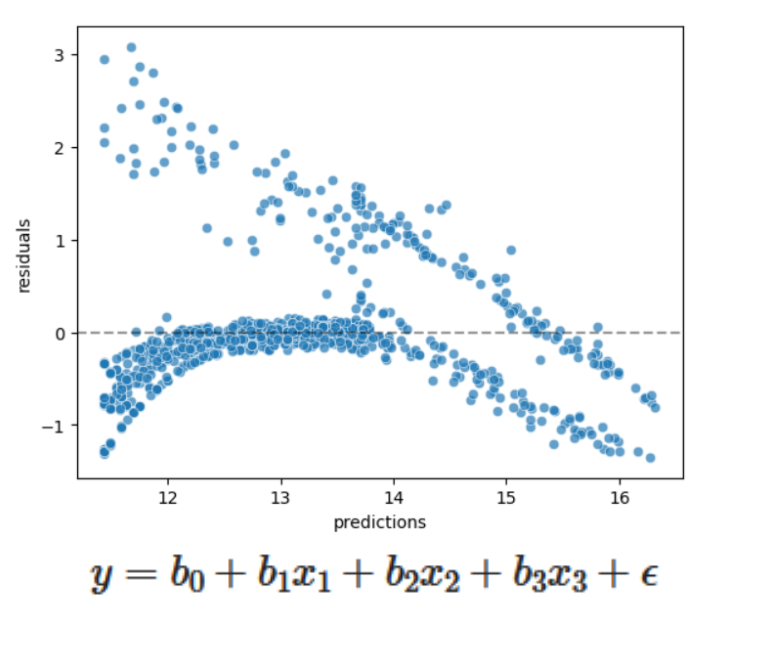

# Predicting Insurance Costs

In this guided project, we’ll use **Linear Regression Modeling** to predict medical insurance costs. Our goal is to build a linear regression model that is as accurate as possible. We’ll use a dataset from Kaggle, available [here](https://www.kaggle.com/datasets/mirichoi0218/insurance?resource=download), which contains 1,338 records of medical billing information. Each row includes unique attributes for a patient. Throughout the project, we’ll explore how patient characteristics relate to their medical charges.

View this project live on Google Colab [here](https://colab.research.google.com/drive/1XUm2xdfncqOvduo-T_gAt6pOZjg2Mxwp?usp=sharing).
